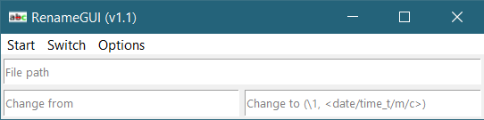

## RenameGUI 

Batch rename files via regex.

### Start

**Using python**  
For all required packages listed in the header of **RenameGUI.py**, check if they are installed in your python distribution (`python -m pip show <package>`) and install if not (`python -m pip install <package>`). If all requirements are installed, execute `python RenameGUI.py`. 

**Executable for windows users**  
For windows users, a ZIP-file with a compiled program is available under Releases. Download, unzip and execute **RenameGUI.exe**.

